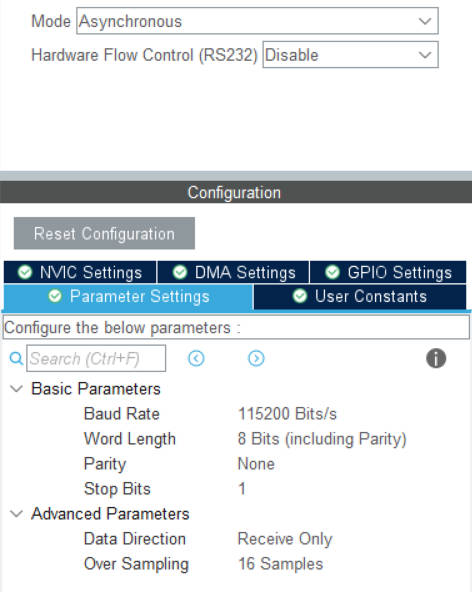

# 编写指南

*To Mr.Huang*

**你不一定严格按照以下要求来实现，你可以通过下面的步骤了解到我们需要实现的是什么效果————适度模块化，解耦调度逻辑和底层驱动！**

1.  CubeMX新建一个项目。

2.  启用一个串口，设置如下，这里拿USART1举例。



**如果你知道我想要实现什么效果，当然可以换成DMA！**

3.  NVIC打开串口全局中断。  


4.  使用串口中断开启函数打开串口中断。

```c
voliate uint8_t wit_data[11]; // 请注意这个变量是全局变量，需要放到适当的位置，由于需要让中断函数处理它，最好加上voliate关键字防止编译器优化
HAL_UART_Receive_IT(&huart1,(uint8_t *)wit_data,11); // 每当串口接收到了11个字节的数据，就会进入中断回调函数处理逻辑
```

5.  编写中断回调函数。

```c
void HAL_UART_RxCpltCallback(UART_HandleTypeDef *huart)
{
    /* 在这里编写解包的逻辑 */

    HAL_UART_Receive_IT(&huart1,(uint8_t *)wit_data,11); // 尤其注意在最后再次打开中断
}
```

6.  根据官方提供的协议规范，在上述说明的地方编写代码，将关键的几个姿态数据正确读出。

[WT61协议](https://wit-motion.yuque.com/wumwnr/ltst03/wegquy#%20%E3%80%8AWT61%E5%8D%8F%E8%AE%AE%E3%80%8B)

7.  将上述解包逻辑封装成头文件和源文件，实现类似如下效果。

```c
#include "wt1_imu.h"

float fAcc[3],fGyro[3],fAngle[3];
WT_SolvePosture(wit_data,&fAcc,&fGyro,fAngle);
printf("acc:%f %f %f\r\n",fAcc[0],fAcc[1],fAcc[2]);
printf("gyro:%f %f %f\r\n",fGyro[0],fGyro[1],fGyro[2]);
printf("angle:%f %f %f\r\n",fAngle[0],fAngle[1],fAngle[2]);
```